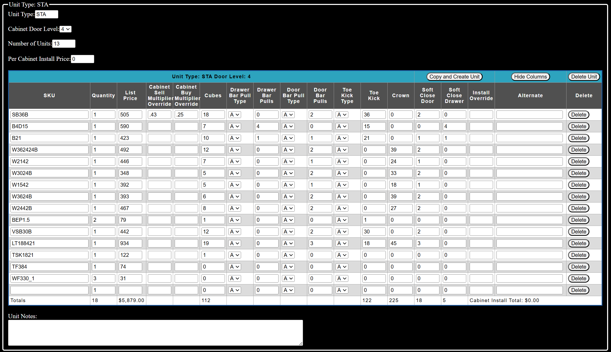
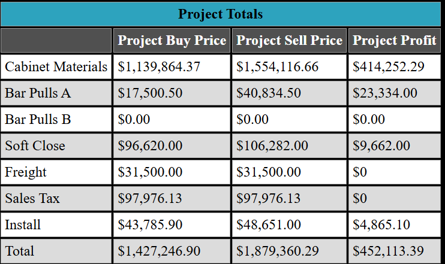
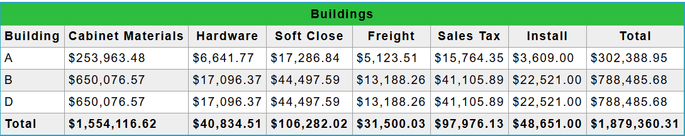
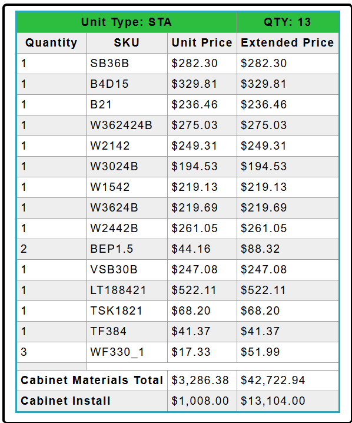

# bespoken - Project Cost Proposal Software

- Reduces manual user data entry by auto populating cost, quantities and other attribute fields through the incorporation of data (digital cost sheets) from multiple material providers.
  
  

- Individualized breakdown of quantities and revenue for hardware and trim specific material as well as freight.
  
  

- Calculates project expenses, revenue and profit on the fly based on quantities of material, installation and hardware.
  
  
  
- Allows the user to quickly generate alternative cost proposals without destroying existing data.
  
- Supports local persistence of projects for future recall and modification.

- Generates customer facing cost/bid proposals in PDF format.
  
  
  
  

- Currently utilizes Google Drive to store proposal documents.
  
- Software can be hosted in Google Cloud Platform and integrated with FireStore.

- Software can be customized to meet specific needs.

  For business inquiries related to this software contact demron.ignace@gmail.com
